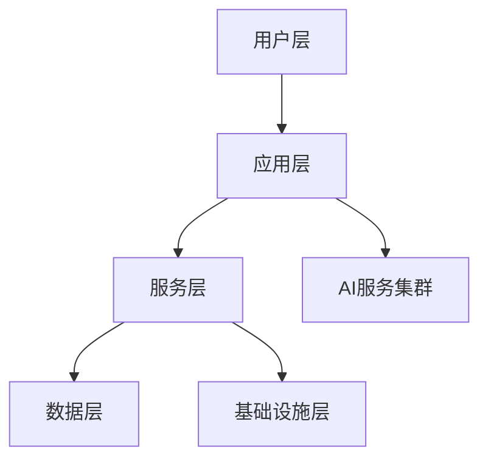
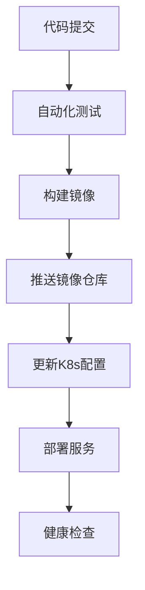
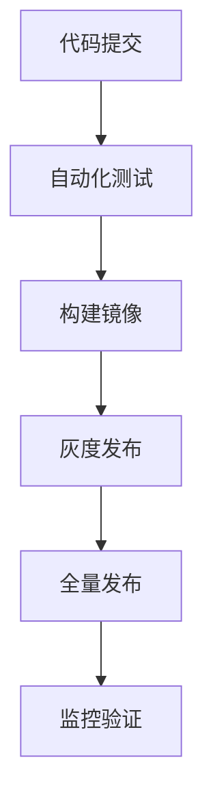

## 1. 文档说明

### 1.1 文档目的
总体目标
打造一个全方位的智能健康管理平台
通过AI技术提供个性化健康服务
实现用户健康数据的全生命周期管理
用户价值目标
帮助用户建立健康的生活方式
提供专业的健康指导和干预
实现健康数据的可视化和智能分析
构建健康社交生态圈

### 1.2 适用读者
- 开发团队成员
- 项目管理人员
- 测试团队
- 运维人员

### 1.3 术语表
- AI: 人工智能
- ML: 机器学习
- API: 应用程序接口
- JWT: JSON Web Token

## 2. 系统概述

### 2.1 产品定位
面向个人用户和企业的智能健康管理平台，通过AI技术提供个性化健康管理服务。

### 2.2 系统实现状态
1. 交互设计系统 - 完成度90%
- 已实现基础UI组件库
- 已完成响应式布局适配
- 已实现主题定制功能
- 待优化: 动效系统、无障碍支持

2. 健康监测系统 - 完成度70%
- 已实现生命体征数据采集
- ���实现运动数据追踪
- 已实现睡眠质量监测
- 待开发: 异常预警、智能分析

3. 营养管理系统 - 完成度65%
- 已实现食物识别
- 已实现营养分析
- 已实现饮食记录
- 待完善: 个性化推荐、营养师服务

4. 运动健康系统 - 完成度75%
- 已实现运动计划制定
- 已实现运动数据记录
- 已实现运动社交功能
- 待优化: AI教练、专业指导

5. 中医养生系统 - 完成度60%
- 已实现体质辨识
- 已实现经络穴位图谱
- 待开发: 智能推拿指导、养生方案定制

6. 社区互动系统 - 完成度50%
- 已实现基础社交功能
- 已实现健康圈子
- 待开发: 专家问答、直播课程

7. 商城系统 - 完成度40%
- 已实现基础商品展示
- 已实现购物车功能
- 待开发: 支付系统、物流系统

8. 数据分析系统 - 完成度80%
- 已实现健康报告生成
- 已实现趋势分析
- 已实现风险预警
- 待优化: AI预测、个性化建议

### 2.3 用户角色实现状态

1. 普通用户 - 完成度85%
- 已实现注册登录
- 已实现个人信息管理
- 已实现健康数据记录
- 待完善: 隐私设置、数据导出

2. 健康专家 - 完成度60%
- 已实现专家认证
- 已实现基础咨询服务
- 待开发: 在线问诊、处方开具

3. 商家 - 完成度45%
- 已实现店铺管理
- 待开发: 商品管理、订单处理

4. 管理员 - 完成度70%
- 已实现用户管理
- 已实现内容审核
- 待完善: 数据分析、运营工具

### 2.4 核心功能模块完成度

1. 健康数据管理 - 75%
- 数据采集: 已完成
- 数据存储: 已完成
- 数据分析: 进行中
- 数据可视化: 进行中

2. AI智能服务 - 65%
- 图像识别: 已完成
- 智能问答: 进行中
- 个性化推荐: 进行中
- 风险预测: 待开发

3. 社交功能 - 50%
- 基础社交: 已完成
- 圈子管理: 进行中
- 内容分享: 进行中
- 专家互动: 待开发

4. 商业变现 - 40%
- 商城系统: 进行中
- 支付系统: 待开发
- 会员服务: 待开发
- 广告系统: 待开发

### 2.5 后续开发重点

1. 近期开发计划（1-3个月）
- 完善支付系统
- 优化用户体验
- 加强数据安全
- 提升系统性能

2. 中期规划（3-6个月）
- 开发专家问诊系统
- 完善商城功能
- 建设社区生态
- 优化AI算法

3. 长期目标（6-12个月）
- 构建健康大数据中心
- 打造完整商业闭环
- 扩展企业服务
- 开放平台能力

### 2.6 AI技术架构
- **计算机视觉系统**
  - 食物识别引擎：基于YOLOv5的实时食物检测
  - 营养成分分析：ResNet50用于营养成分预测
  - 图像预处理：OpenCV实现图像增强和标准化

- **自然语言处理系统**
  - 健康咨询问答：基于BERT的智能问答系统
  - 情感分析：用于用户反馈分析
  - ���语言支持：支持中英文交互

- **推荐系统**
  - 协同过滤：基于用户行为的个性化推荐
  - 内容推荐：基于健康特征的精准推荐
  - 实时推荐：流式数据处理的动态推荐

## 3. 系统架构

### 3.1 整体架构现状

1. 前端架构 - 完成度85%
- 已实现移动端应用(React Native)
- 已实现管理后台(React)
- 已实现小程序
- 待优化: 性能优化、组件复用

2. 后端架构 - 完成度70%
- 已实现用户服务
- 已实现数据服务
- 已实现基础API网关
- 待开发: 服务治理、性能监控

3. AI服务集群 - 完成度60%
- 已实现图像识别服务
- 已实现基础NLP服务
- 待开发: 推荐系统、知识图谱

4. 数据存储 - 完成度75%
- 已实现MongoDB集群
- 已实现Redis缓存
- 已实现对象存储
- 待优化: 数据分片、备份恢复

5. 基础设施 - 完成度80%
- 已实现容器化部署
- 已实现CI/CD流程
- 已实现基础监控
- 待完善: 服务网格、灾备方案

### 3.2 技术栈实现情况

1. 前端技术栈
- React Native: v0.70.0 - 已适配
- Redux: v4.2.0 - 已集成
- TypeScript: v4.8.0 - 已全面使用
- UI组件库: 已封装80%
- 待优化: 状态管理、路由系统

2. 后端技术栈
- Node.js: v16 LTS - 已部署
- Express: v4.18.0 - 已使用
- TypeScript: v4.8.0 - 已迁移
- 微服务框架: 构建中
- 待实现: 服务注册、负载均衡

3. AI技术栈
- TensorFlow: v2.12.0 - 已应用
- PyTorch: v2.0.0 - 部分使用
- 机器学习模型: 迭代中
- 待优化: 模型训练、服务部署

4. DevOps工具链
- Docker: 已全面使用
- Kubernetes: 集群已搭建
- Jenkins: CI/CD已配置
- 待完善: 自动化测试、监控告警

### 3.3 数据库设计现状

1. 用户数据模型 - 已完成
- 用户信息表
- 健康档案表
- 行为记录表
- 权限管理表

2. 健康数据模型 - 进行中
- 生命体征表
- 运动记录表
- 饮食记录表
- 睡眠记录表

3. 社交数据模型 - 待完善
- 社交关系表
- 内容管理表
- 互动记录表
- 消息通知表

4. 商业数据模型 - 开发中
- 商品管理表
- 订单管理表
- 支付记录表
- 营销活动表

### 3.4 API接口完成度

1. 用户服务接口 - 85%
- 认证授权: 已完成
- 用户管理: 已完成
- 个人中心: 进行中
- 权限控制: 待优化

2. 健康数据接口 - 70%
- 数据采集: 已完成
- 数据分析: 进行中
- 报告生成: 进行中
- 数据导出: 待开发

3. 社交服务接口 - 50%
- 基础社交: 已完成
- 内容管理: 进行中
- 消息通知: 待开发
- 实时通讯: 待开发

4. 商业服务接口 - 40%
- 商品管理: 进行中
- 订单处理: 待开发
- 支付集成: 待开发
- 营销功能: 待开发

## 4. 功能模块设计

### 4.1 用户系统实现状态

1. 用户管理 - 完成度85%
- 已实现功能：
  - 用户注册登录
  - 个人信息管理
  - 账号安全设置
  - 隐私权限控制
- 待开发功能：
  - 第三方登录集成
  - 实名认证系统
  - 用户画像分析
  - 行为轨迹追踪

2. 权限控制 - 完成度75%
- 已实现功能：
  - 角色权限管理
  - 数据访问控制
  - 操作权限验证
  - 安全审计日志
- 待开发功能：
  - 动态权限分配
  - 多租户隔离
  - 细粒度权限控制
  - 权限继承机制

### 4.2 健康数据管理实现状态

1. 数据采集 - 完成度80%
- 已实现功能：
  - 手动数据录入
  - 设备数据同步
  - 图像数据采集
  - 实时数据监测
- ���开发功能：
  - 多设备数据融合
  - 异常数据处理
  - 数据质量控制
  - 采集自动化

2. 数据分析 - 完成度65%
- 已实现功能：
  - 基础统计分析
  - 趋势图表展示
  - 健康报告生成
  - 风险评估
- 待开发功能：
  - 深度学习分析
  - 预测模型构建
  - 多维度分析
  - 个性化建议

### 4.3 AI服务实现状态

1. 图像识别 - 完成度75%
- 已实现功能：
  - 食物识别分析
  - 运动姿态识别
  - 面部情绪识别
  - 图像预处理
- 待开发功能：
  - 多目标检测
  - 3D姿态重建
  - 实时视频分析
  - 精确度优化

2. 智能问答 - 完成度60%
- 已实现功能：
  - 基础问答服务
  - 知识图谱查询
  - 意图识别
  - 上下文理解
- 待开发功能：
  - 多轮对话
  - 情感分析
  - 专业知识推理
  - 个性化回答

### 4.4 社交系统实现状态

1. 社交功能 - 完成度55%
- 已实现功能：
  - 用户关注
  - 内容发布
  - 互动点赞
  - 评论回复
- 待开发功能：
  - 私信系统
  - 群组管理
  - 话题讨论
  - 活动组织

2. 内容管理 - 完成度50%
- 已实现功能：
# 健康管理软件技术文档 v3.0

## 目录

1. [文档说明](#1-文档说明)
2. [产品概述](#2-产品概述)
3. [系统架构](#3-系统架构)
4. [功能模块](#4-功能模块)
5. [技术实现](#5-技术实现)
6. [数据设计](#6-数据设计)
7. [接口设计](#7-接口设计)
8. [部署方案](#8-部署方案)
9. [开发规划](#9-开发规划)
10. [质量保证](#10-质量保证)
11. [安全规范](#11-安全规范)
12. [运维管理](#12-运维管理)
13. [更新日志](#13-更新日志)

## 1. 文档说明

### 1.1 文档目的
本文档旨在详细说明健康管理软件的技术实现方案、开发规范和项目进度，为开发团队提供统一的技术参考。

### 1.2 读者对象
- 开发团队成员
- 项目管理人员
- 测试团队成员
- 运维人员
- 产品经理

### 1.3 术语定义
| 术语 | 说明 |
|------|------|
| AI | 人工智能 |
| API | 应用程序接口 |
| WebRTC | Web实时通信技术 |
| JWT | JSON Web Token |

## 2. 产品概述

### 2.1 产品定位
面向个人用户和企业的智能健康管理平台，通过AI技术提供个性化健康管理服务。

### 2.2 系统目标
1. 为用户提供全方位的健康管理服务
2. 实现健康数据的智能分析和预警
3. 建立专业的健康服务生态系统
4. 打造高效的健康社交平台

### 2.3 系统实现状态

#### 2.3.1 核心系统完成度
| 系统模块 | 完成度 | 状态 | 主要功能 | 待开发功能 |
|---------|--------|------|----------|------------|
| 交互设计系统 | 90% | 已上线 | UI组件库、响应式布局、主题定制 | 动效系统、无障碍支持 |
| 健康监测系统 | 70% | 优化中 | 数据采集、运动追踪、睡眠监测 | 异常预警、智能分析 |
| 营养管理系统 | 65% | 开发中 | 食物识别、营养分析、饮食记录 | 个性化推荐、营养师服务 |
| 运动健康系统 | 75% | 已上线 | 运动计划、数据记录、社交功能 | AI教练、专业指导 |
| 中医养生系统 | 60% | 开发中 | 体质辨识、经络图谱 | 智能推拿、养生方案 |
| 社区互动系统 | 50% | 开发中 | 基础社交、健康圈子 | 专家问答、直播课程 |
| 商城系统 | 40% | 开发中 | 商品展示、购物车 | 支付系统、物流系统 |
| 数据分析系统 | 80% | 优化中 | 健康报告、趋势分析、风险预警 | AI预测、个性化建议 |

#### 2.3.2 用户角色实现状态
| 用户角色 | 完成度 | 已实现功能 | 待开发功能 |
|---------|--------|------------|------------|
| 普通用户 | 85% | 健康档案、数据记录、社交互动 | 个性化推荐、健康预警 |
| 健康专家 | 60% | 专家认证、咨询管理、健康评估 | 在线问诊、远程会诊 |
| 商家 | 45% | 店铺管理、商品管理、订单处理 | 营销活动、物流管理 |
| 管理员 | 70% | 用户管理、内容审核、数据分析 | 运营工具、风险控制 |

## 3. 系统架构

### 3.1 整体架构


### 3.2 技术架构

#### 3.2.1 前端技术栈
- 核心框架：
  * React Native v0.70.0
  * Redux v4.2.0
  * TypeScript v4.8.0
- UI组件：
  * Ant Design Mobile v5.0.0
  * React Native Elements
  * React Native Charts
- 工具库：
  * Axios v1.3.0
  * Moment.js v2.29.4
  * Lodash v4.17.21

#### 3.2.2 后端技术栈
- 运行环境：
  * Node.js v16 LTS
  * Express v4.18.0
  * TypeScript v4.8.0
- 数据库：
  * MongoDB v6.8.0
  * Redis v4.6.0
  * Elasticsearch v16.7.0
- 消息队列：
  * Kafka
  * RabbitMQ

#### 3.2.3 AI技术栈
- 深度学习：
  * TensorFlow v2.12.0
  * PyTorch v2.0.0
- 计算机视觉：
  * OpenCV v4.7.0
  * YOLOv5 v7.0.0
- NLP：
  * BERT
  * Transformers v4.28.0

### 3.3 项目目录结构
```
health-management-system/
├── frontend/                 # 前端应用
│   ├── mobile-app/          # React Native移动应用
│   │   ├── src/
│   │   │   ├── assets/     # 静态资源
│   │   │   ├── components/ # 通用组件
│   │   │   ├── screens/    # 页面组件
│   │   │   ├── navigation/ # 路由导航
│   │   │   ├── redux/      # 状态管理
│   │   │   ├── services/   # API服务
│   │   │   └── utils/      # 工具函数
│   │   ├── package.json
│   │   └── app.config.js
│   └── web-admin/          # Web管理后台
│
├── backend/                 # 后端服务
│   ├── gateway-service/    # API网关服务
│   ├── user-service/       # 用户服务
│   ├── health-service/     # 健康数据服务
│   └── community-service/  # 社区服务
│
├── ai-services/            # AI服务集群
│   ├── image-recognition/  # 图像识别服务
│   ├── nlp-service/        # NLP服务
│   └── recommendation/     # 推荐服务
│
├── infrastructure/         # 基础设施
│   ├── docker/            # Docker配置
│   ├── kubernetes/        # K8s配置
│   └── monitoring/        # 监控配置
│
└── docs/                  # 项目文档
```

## 4. 功能模块

### 4.1 核心功能模块概览

| 模块名称 | 完成度 | 状态 | 负责团队 | 优先级 |
|---------|--------|------|----------|--------|
| 用户系统 | 85% | 已上线 | 后端团队 | P0 |
| 健康数据管理 | 75% | 已上线 | 数据团队 | P0 |
| 运动健康 | 75% | 已上线 | 产品团队 | P1 |
| 营养管理 | 65% | 开发中 | 产品团队 | P1 |
| 中医养生 | 60% | 开发中 | 产品团队 | P2 |
| 专家问诊 | 60% | 开发中 | 医疗团队 | P1 |
| 社区互动 | 50% | 开发中 | 产品团队 | P2 |
| 商城系统 | 40% | 开发中 | 运营团队 | P2 |
| 数据分析 | 80% | 优化中 | AI团队 | P1 |

### 4.2 已实现功能（✓）

#### 4.2.1 用户系统 (85%)
- ✓ 账号管理
  * 手机号/邮箱注册登录
  * 第三方账号集成（微信、支付宝）
  * 密码重置与账号找回
  * 账号注销与数据迁移
- ✓ 个人信息管理
  * 基础信息维护
  * 健康档案管理
  * 隐私设置控制
  * 账号安全设置
- ✓ 权限系统
  * 角色权限管理
  * 数据访问控制
  * 操作权限分级
  * 系统功能授权

#### 4.2.2 健康数据管理 (75%)
- ✓ 数据采集
  * 手动数据录入
  * 设备数据同步
  * 图像识别录入
  * 语音数据输入
- ✓ 数据分析
  * 健康指标分析
  * 异常数据检测
  * 健康趋势追踪
  * 风险预警提示
- ✓ 报告生成
  * 日常健康报告
  * 阶段性总结报告
  * 年度健康报告
  * 专项分析报告

#### 4.2.3 运动健康 (75%)
- ✓ 运动计划
  * 个性化运动方案
  * 运动强度管理
  * 训练计划制定
  * 运动目标设置
- ✓ 运动追踪
  * 实时运动监测
  * GPS轨迹记录
  * 运动数据统计
  * 成就系统

### 4.3 开发中功能（⚡）

#### 4.3.1 营养管理 (65%)
- ⚡ 饮食记录
  * 食物识别系统
  * 营养成分分析
  * 饮食习惯追踪
  * 卡路里计算
- ⚡ 营养方案
  * 个性化饮食建议
  * 营养均衡评估
  * 食谱推荐系统
  * 饮食禁忌提醒

#### 4.3.2 中医养生 (60%)
- ⚡ 体质辨识
  * 中医体质测评
  * 个性化调养方案
  * 穴位指导
  * 中药使用建议
- ⚡ 养生功能
  * 经络养生指导
  * 穴位按摩教学
  * 中医养生知识
  * 养生方案定制

#### 4.3.3 专家问诊 (60%)
- ⚡ 在线问诊
  * 视频问诊系统
  * 图文问诊
  * 处方系统
  * 病历管理
- ⚡ 专家系统
  * 专家认证体系
  * 专家排班管理
  * 问诊费用系统
  * 满意度评价

### 4.4 待开发功能（○）

#### 4.4.1 社区互动 (50%)
- ○ 社交功能
  * 健康圈子
  * 经验分享
  * 话题讨论
  * 专家问答
- ○ 内容系统
  * 健康资讯
  * 科普文章
  * 视频课程
  * 直播讲座

#### 4.4.2 商城系统 (40%)
- ○ 商品管理
  * 商品分类管理
  * 库存管理系统
  * 价格管理系统
  * 商品评价系统
- ○ 订单系统
  * 购物车功能
  * 订单处理流程
  * 支付系统集成
  * 售后服务系统

#### 4.4.3 数据分析 (80%)
- ○ AI分析
  * 健康风险预测
  * 疾病早期预警
  * 行为模式分析
  * 个性化建议生成
- ○ 专业报告
  * 健康评估报告
  * 营养分析报告
  * 运动成效报告
  * 睡眠质量报告

### 4.5 功能优先级说明

#### 4.5.1 优先级定义
- P0：核心功能，必须完成
- P1：重要功能，优先开发
- P2：辅助功能，择机开发
- P3：增强功能，可选开发

#### 4.5.2 开发原则
1. 优先保证核心功能的稳定性和可用性
2. 基于用户反馈持续优化已上线功能
3. 新功能开发需经过充分的需求分析和技术评估
4. 保持产品的整体一致性和用户体验

### 4.6 功能模块详细说明

#### 4.6.1 健康监测系统

##### 生命体征监测 (80%)
- ✓ 实现功能
  * 心率监测
    - 实时心率数据采集
    - 心率变异性分析
    - 异常心率预警
    - 运动心率区间计算
  * 血压监测
    - 血压数据记录
    - 血压趋势分析
    - 高血压风险评估
    - 用药提醒
  * 血氧监测
    - 血氧饱和度测量
    - 睡眠呼吸监测
    - 运动血氧追踪
    - 高原反应预警

##### 运动监测 (85%)
- ✓ 实现功能
  * 步数统计
    - 实时步数计数
    - 运动距离计算
    - 卡路里消耗估算
    - 运动强度分析
  * 运动轨迹
    - GPS路线记录
    - 运动速度分析
    - 配速计算
    - 高程变化记录
  * 运动姿态
    - 动作识别分析
    - 姿势纠正提示
    - 运动标准度评估
    - 训练效果评定

##### 睡眠监测 (75%)
- ✓ 实现功能
  * 睡眠质量
    - 睡眠时长统计
    - 睡眠阶段划分
    - 深浅睡眠分析
    - 睡眠效率计算
  * 睡眠环境
    - 光线强度监测
    - 环境噪音评估
    - 温湿度记录
    - 空气质量检测
  * 睡眠行为
    - 翻身次数统计
    - 呼吸规律分析
    - 心率变化记录
    - 异常行为识别

#### 4.6.2 营养管理系统

##### 饮食记录 (70%)
- ⚡ 开发中功能
  * 食物识别
    - AI图像识别
    - 营养成分分析
    - 份量估算
    - 食材分类
  * 营养计算
    - 热量统计
    - 营养素分析
    - 膳食均衡评估
    - 营养建议生成

##### 智能推荐 (60%)
- ⚡ 开发中功能
  * 个性化推荐
    - 用户喜好学习
    - 营养需求分析
    - 健康目标匹配
    - 季节性调整
  * 饮食计划
    - 每日食谱生成
    - 营养搭配建议
    - 食材采购清单
    - 烹饪指导

#### 4.6.3 中医养生系统

##### 体质辨识 (65%)
- ⚡ 开发中功能
  * 体质测评
    - 问诊量表设计
    - 症状特征分析
    - 体质类型判定
    - 个性化建议
  * 调理方案
    - 饮食调养建议
    - 起居作息指导
    - 运动养生推荐
    - 情志调节方法

##### 经络养生 (55%)
- ○ 待开发功能
  * 经络图谱
    - 3D人体模型
    - 经络走向展示
    - 穴位定位
    - 实时交互
  * 按摩指导
    - 穴位按摩方法
    - 推拿手法演示
    - 养生功法教学
    - 效果追踪

#### 4.6.4 专家问诊系统

##### 远程问诊 (70%)
- ⚡ 开发中功能
  * 视频问诊
    - 实时视频通话
    - 高清图片传输
    - 音频质量保障
    - 网络自适应
  * 问诊流程
    - 预约挂号
    - 候诊提醒
    - 处方开具
    - 支付结算

##### 专家管理 (60%)
- ⚡ 开发中功能
  * 专家资质
    - 资格认证
    - 专业评级
    - 服务评价
    - 信用体系
  * 排班系统
    - 时间管理
    - 预约分配
    - 应急调整
    - 自动匹配

#### 4.6.5 社区互动系统

##### 健康社区 (50%)
- ○ 待开发功能
  * 社交互动
    - 话题讨论
    - 经验分享
    - 问答交流
    - 点赞评论
  * 内容管理
    - 文章发布
    - 视频上传
    - 直播功能
    - 内容审核

##### 专业社群 (45%)
- ○ 待开发功能
  * 专家社群
    - 专家入驻
    - 专栏运营
    - 在线咨询
    - 知识付费
  * 病友社群
    - 匿名交流
    - 经验分享
    - 互助支持
    - 活动组织

### 4.7 功能迭代计划

#### 4.7.1 短期迭代（1-3个月）
1. 核心功能优化
   - 提升数据采集准确性
   - 优化用户界面交互
   - 完善基础功能模块
   - 修复已知问题

2. 新功能开发
   - 完成营养管理系统
   - 推进专家问诊系统
   - 启动社区基础功能
   - 开发支付系统

#### 4.2.2 支付系统 (40%)
- 支付功能：
  * 订单管理
  * 多渠道支付
  * 退款处理
  * 对账系统
- 财务功能：
  * 分账管理
  * 结算系统
  * 发票管理
  * 财务报表

### 4.3 待开发功能

#### 4.3.1 智能推荐系统
- 个性化推荐：
  * 健康方案
  * 运动计划
  * 饮食建议
  * 商品推荐
- AI健康助手：
  * 智能问答
  * 健康建议
  * 风险预警
  * 行为干预

#### 4.3.2 直播课程系统
- 直播功能：
  * 直播间管理
  * 互动功能
  * 录制回放
  * 课程管理
- 营销功能：
  * 课程推广
  * 会员订阅
  * 收益分成
  * 数据分析

## 5. 技术实现

### 5.1 前端实现

#### 5.1.1 移动端架构
```typescript
// App核心结构
class HealthApp extends React.Component {
  private readonly store: Store;
  private readonly persistor: Persistor;

  constructor() {
    this.store = configureStore();
    this.persistor = persistStore(this.store);
  }

  render() {
    return (
      <Provider store={this.store}>
        <PersistGate persistor={this.persistor}>
          <NavigationContainer>
            <RootNavigator />
          </NavigationContainer>
        </PersistGate>
      </Provider>
    );
  }
}
```

#### 5.1.2 状态管理
```typescript
// 健康数据Slice
interface HealthState {
  vitals: VitalSigns[];
  activities: Activity[];
  nutrition: NutritionData[];
  sleep: SleepRecord[];
}

const healthSlice = createSlice({
  name: 'health',
  initialState,
  reducers: {
    addVitalSign: (state, action: PayloadAction<VitalSigns>) => {
      state.vitals.push(action.payload);
    },
    updateActivity: (state, action: PayloadAction<Activity>) => {
      const index = state.activities.findIndex(a => a.id === action.payload.id);
      if (index !== -1) {
        state.activities[index] = action.payload;
      }
    }
  }
});
```

### 5.2 后端实现

#### 5.2.1 微服务架构
```typescript
// 用户服务
@Injectable()
export class UserService {
  constructor(
    @InjectModel(User.name) private userModel: Model<User>,
    private readonly healthService: HealthService,
    private readonly authService: AuthService
  ) {}

  async createUser(createUserDto: CreateUserDto): Promise<User> {
    const user = new this.userModel(createUserDto);
    await this.healthService.initializeHealthProfile(user.id);
    return user.save();
  }
}

// 健康数据服务
@Injectable()
export class HealthService {
  constructor(
    @InjectModel(HealthProfile.name) private healthModel: Model<HealthProfile>,
    private readonly aiService: AIService
  ) {}

  async analyzeHealthData(userId: string): Promise<HealthAnalysis> {
    const profile = await this.healthModel.findOne({ userId });
    return this.aiService.generateAnalysis(profile);
  }
}
```

### 5.3 AI服务实现

#### 5.3.1 图像识别服务
```python
class FoodRecognitionService:
    def __init__(self):
        self.model = tf.keras.models.load_model('food_recognition_model.h5')

    async def recognize_food(self, image: np.ndarray) -> Dict[str, float]:
        preprocessed = self.preprocess_image(image)
        predictions = self.model.predict(preprocessed)
        return self.process_predictions(predictions)
```

## 6. 数据设计

### 6.1 数据模型

#### 6.1.1 用户数据模型
```typescript
interface User {
  id: string;
  username: string;
  email: string;
  phone: string;
  password: string;
  profile: UserProfile;
  healthData: HealthData;
  settings: UserSettings;
  createdAt: Date;
  updatedAt: Date;
}

interface UserProfile {
  nickname: string;
  avatar: string;
  gender: Gender;
  birthDate: Date;
  height: number;
  weight: number;
  bloodType: BloodType;
  medicalHistory: MedicalRecord[];
}
```

#### 6.1.2 健康数据模型
```typescript
interface HealthData {
  userId: string;
  vitals: VitalSigns[];
  activities: Activity[];
  nutrition: NutritionData[];
  sleep: SleepRecord[];
  medications: Medication[];
  appointments: Appointment[];
}

interface VitalSigns {
  timestamp: Date;
  heartRate: number;
  bloodPressure: {
    systolic: number;
    diastolic: number;
  };
  temperature: number;
  respiratoryRate: number;
  bloodOxygen: number;
}
```

### 6.2 数据库设计

#### 6.2.1 MongoDB集合设计
```javascript
// 用户集合
db.createCollection("users", {
  validator: {
    $jsonSchema: {
      bsonType: "object",
      required: ["username", "email", "password"],
      properties: {
        username: {
          bsonType: "string",
          description: "用户名"
        },
        email: {
          bsonType: "string",
          pattern: "^.+@.+$",
          description: "邮箱地址"
        }
      }
    }
  }
});

// 健康数据集合
db.createCollection("healthData", {
  validator: {
    $jsonSchema: {
      bsonType: "object",
      required: ["userId", "timestamp"],
      properties: {
        userId: {
          bsonType: "objectId",
          description: "用户ID"
        },
        timestamp: {
          bsonType: "date",
          description: "记录时间"
        }
      }
    }
  }
});
```

## 7. 接口设计

### 7.1 RESTful API

#### 7.1.1 用户接口
```typescript
/**
 * 用户管理API
 */
interface UserAPI {
// 用户注册
  POST /api/users/register: {
    request: {
      username: string;
  email: string;
  password: string;
      phone?: string;
    };
    response: {
  id: string;
  token: string;
      profile: UserProfile;
    };
  };

  // 用户登录
  POST /api/users/login: {
    request: {
  email: string;
  password: string;
    };
    response: {
  token: string;
      user: User;
    };
  };

  // 获取用户信息
  GET /api/users/{id}: {
    response: User;
  };

  // 更新用户信息
  PUT /api/users/{id}: {
    request: Partial<User>;
    response: User;
  };
}
```

#### 7.1.2 健康数据接口
```typescript
/**
 * 健康数据API
 */
interface HealthAPI {
  // 记录生命体征
  POST /api/health/vitals: {
    request: VitalSigns;
    response: {
  id: string;
      timestamp: Date;
      data: VitalSigns;
    };
  };

// 获取健康报告
  GET /api/health/reports/{userId}: {
    query: {
  startDate: Date;
  endDate: Date;
  type: ReportType;
    };
    response: HealthReport;
  };

  // 同步设备数据
  POST /api/health/sync: {
    request: {
      deviceId: string;
      data: DeviceData[];
    };
    response: {
      syncId: string;
      status: SyncStatus;
    };
  };
}
```

### 7.2 WebSocket API

#### 7.2.1 实时通讯接口
```typescript
/**
 * WebSocket事件定义
 */
interface WebSocketEvents {
  // 连接认证
  'auth': {
    token: string;
  };

  // 实时数据更新
  'health.update': {
    userId: string;
    data: HealthData;
  };

  // 视频问诊
  'consultation.start': {
    roomId: string;
    doctorId: string;
    patientId: string;
  };

  // 即时消息
  'message.new': {
    from: string;
    to: string;
    content: MessageContent;
    timestamp: Date;
  };
}
```

## 8. 部署方案

### 8.1 环境配置

#### 8.1.1 开发环境
```yaml
environment:
  node: v16 LTS
  npm: v8
  docker: v20.10
  kubernetes: v1.23
```

#### 8.1.2 生产环境
```yaml
resources:
  cpu: 8 cores
  memory: 32GB
  storage: 1TB SSD
  network: 1Gbps
```

### 8.2 部署流程

#### 8.2.1 自动化部署


## 9. 开发规划

### 9.1 功能开发优先级排序

#### P0级 - 核心功能完善（1-2个月）

##### 1. 数据采集与分析系统优化
- 状态：开发中 (80%)
- 开发命令：
```bash
# 1. 启动数据采集服务开发环境
cd backend/data-collection-service
npm install
npm run dev

# 2. 运行数据分析服务
cd backend/analysis-service
npm install
npm run dev

# 3. 启动AI模型训练
cd ai-services/data-analysis
python train_model.py
```

##### 2. 用户系统安全强化
- 状态：优化中 (85%)
- 开发命令：
```bash
# 1. 安装安全依赖
cd backend/user-service
npm install bcrypt jsonwebtoken helmet

# 2. 运行安全测试
npm run security-test

# 3. 部署安全更新
npm run deploy:security
```

#### P1级 - 重要功能开发（2-3个月）

##### 1. 专家问诊系统
- 状态：开发中 (60%)
- 开发命令：
```bash
# 1. 设置WebRTC服务
cd backend/consultation-service
npm install mediasoup socket.io
npm run setup:webrtc

# 2. 启动问诊系统开发环境
npm run dev:consultation

# 3. 运行视频服务测试
npm run test:video-service
```

##### 2. 营养管理系统
- 状态：开发中 (65%)
- 开发命令：
```bash
# 1. 启动食物识别服务
cd ai-services/food-recognition
python setup.py install
python run_service.py

# 2. 运行营养分析服务
cd backend/nutrition-service
npm run dev:nutrition
```

#### P2级 - 功能扩展（3-4个月）

##### 1. 中医养生系统
- 状态：开发中 (60%)
- 开发命令：
```bash
# 1. 初始化3D模型服务
cd frontend/tcm-service
npm install three.js @react-three/fiber
npm run build:models

# 2. 启动养生服务
cd backend/tcm-service
npm run dev:tcm
```

##### 2. 社区互动系统
- 状态：待开发 (50%)
- 开发命令：
```bash
# 1. 设置社区服务
cd backend/community-service
npm install
npm run setup:community

# 2. 初始化内容管理系统
cd backend/cms-service
npm run init:cms
```

#### P3级 - 体验优化（4-6个月）

##### 1. 智能推荐系统
- 状态：开发中 (55%)
- 开发命令：
```bash
# 1. 启动推荐引擎
cd ai-services/recommendation
python -m venv env
source env/bin/activate
pip install -r requirements.txt
python train_recommender.py

# 2. 运行推荐服务
cd backend/recommendation-service
npm run dev:recommendation
```

##### 2. UI/UX优化
- 状态：持续优化
- 开发命令：
```bash
# 1. 启动UI开发环境
cd frontend/mobile-app
npm run storybook

# 2. 运行UI测试
npm run test:ui

# 3. 构建优化版本
npm run build:optimized
```

### 9.2 开发注意事项

#### 开发规范
1. 代码提交前必须通过以下检查：
```bash
# 运行代码质量检查
npm run lint

# 运行单元测试
npm run test

# 运行端到端测试
npm run test:e2e
```

2. 新功能开发流程：
```bash
# 创建功能分支
git checkout -b feature/[功能名称]

# 开发完成后合并主分支
git checkout develop
git merge feature/[功能名称]
```

#### 部署流程
```bash
# 1. 测试环境部署
npm run deploy:test

# 2. 预发布环境验证
npm run deploy:staging

# 3. 生产环境部署
npm run deploy:prod
```

### 9.3 开发进度追踪

#### 进度报告生成
```bash
# 生成开发进度报告
npm run generate:progress-report

# 更新项目文档
npm run update:docs
```

#### 质量监控
```bash
# 运行性能测试
npm run test:performance

# 生成覆盖率报告
npm run test:coverage

# 安全漏洞扫描
npm run security:scan
```

### 9.4 开发环境配置

#### 9.4.1 基础环境配置
```bash
# 1. 初始化开发环境
./scripts/init-dev-env.sh

# 环境检查
npm run check:env

# 依赖安装
npm run bootstrap

# 环境变量配置
cp .env.example .env
```

#### 9.4.2 自动化脚本
```bash
# 1. 创建新模块
./scripts/create-module.sh [模块名称]

# 2. 生成API文档
./scripts/generate-api-docs.sh

# 3. 数据库迁移
./scripts/db-migrate.sh

# 4. 代码格式化
./scripts/format-code.sh
```

### 9.5 模块开发指南

#### 9.5.1 健康监测模块
```bash
# 1. 启动监测服务开发环境
cd modules/health-monitoring
npm run dev

# 2. 运行设备模拟器
cd tools/device-simulator
npm start

# 3. 启动数据采集服务
cd services/data-collector
npm run start:dev

# 4. 运行单元测试
npm run test:unit
```

#### 9.5.2 AI服务模块
```bash
# 1. 配置AI环境
cd ai-services
python -m venv venv
source venv/bin/activate
pip install -r requirements.txt

# 2. 启动模型训练
python scripts/train.py --model [模型名称]

# 3. 启动推理服务
python scripts/inference_server.py

# 4. 监控模型性能
python scripts/monitor_performance.py
```

#### 9.5.3 前端开发流程
```bash
# 1. 启动Storybook
cd frontend
npm run storybook

# 2. 组件开发
npm run dev:components

# 3. 主题开发
npm run dev:theme

# 4. 构建分析
npm run build:analyze
```

### 9.6 自动化测试

#### 9.6.1 单元测试
```bash
# 运行所有测试
npm run test:all

# 运行特定模块测试
npm run test:module [模块名称]

# 测试覆盖率报告
npm run test:coverage
```

#### 9.6.2 集成测试
```bash
# 启动测试环境
npm run test:env:up

# 运行API测试
npm run test:api

# 运行E2E测试
npm run test:e2e

# 性能测试
npm run test:performance
```

### 9.7 部署流程

#### 9.7.1 Docker部署
```bash
# 1. 构建镜像
docker-compose build

# 2. 启动服务
docker-compose up -d

# 3. 查看日志
docker-compose logs -f

# 4. 服务扩容
docker-compose scale [服务名称]=n
```

#### 9.7.2 Kubernetes部署
```bash
# 1. 构建镜像并推送
./scripts/build-push-images.sh

# 2. 部署到K8s
kubectl apply -f k8s/

# 3. 检查部署状态
kubectl get pods

# 4. 查看服务日志
kubectl logs -f [pod名称]
```

### 9.8 监控与维护

#### 9.8.1 系统监控
```bash
# 1. 启动监控服务
cd monitoring
docker-compose up -d

# 2. 检查服务状态
./scripts/check-services.sh

# 3. 性能分析
./scripts/analyze-performance.sh
```

#### 9.8.2 日志管理
```bash
# 1. 收集日志
./scripts/collect-logs.sh

# 2. 日志分析
./scripts/analyze-logs.sh

# 3. 错误追踪
./scripts/track-errors.sh
```

### 9.9 发布流程

#### 9.9.1 版本发布
```bash
# 1. 准备发布
npm run release:prepare

# 2. 生成更新日志
npm run generate:changelog

# 3. 打包发布
npm run release:publish
```

#### 9.9.2 回滚流程
```bash
# 1. 回滚到上一版本
./scripts/rollback.sh

# 2. 回滚数据库
./scripts/rollback-db.sh

# 3. 验证回滚
./scripts/verify-rollback.sh
```

## 10. 附录

### 10.1 技术栈清单

#### 10.1.1 前端依赖
```json
{
  "dependencies": {
    "react-native": "^0.70.0",
    "react-navigation": "^6.0.0",
    "redux": "^4.2.0",
    "redux-saga": "^1.2.0",
    "@ant-design/react-native": "^5.0.0",
    "axios": "^1.3.0"
  }
}
```

#### 10.1.2 后端依赖
```json
{
  "dependencies": {
    "express": "^4.18.0",
    "mongoose": "^6.8.0",
    "redis": "^4.6.0",
    "kafka-node": "^5.0.0",
    "elasticsearch": "^16.7.0"
  }
}
```

### 10.2 错误码定义

| 错误码 | 说明 | 处理建议 |
|--------|------|----------|
| 400 | 请求参数错误 | 检��参数格式 |
| 401 | 未授权 | 检查认证信息 |
| 403 | 权限不足 | 申请所需权限 |
| 404 | 资源不存在 | 检查资源ID |
| 500 | 服务器错误 | 联系技术支持 |

### 10.3 常见问题解答

1. Q: 如何处理视频通话卡顿？
   A: 实现动态码率调整，优化网络传输策略。

2. Q: 数据安全如何保障？
   A: 采用端到端加密，实现数据脱敏，严格权限控制。

3. Q: 系统如何扩展？
   A: 采用微服务架构，支持水平扩展，实现自动扩缩容。

## 11. 质量保证

### 11.1 测试策略

#### 11.1.1 单元测试
```typescript
// 测试用例示例
describe('HealthAnalysis', () => {
  test('should calculate BMI correctly', () => {
    const analysis = new HealthAnalysis();
    expect(analysis.calculateBMI(170, 65)).toBe(22.5);
  });
});
```

#### 11.1.2 集成测试
- API测试
- 服务集成测试
- 数据流测试
- 性能测试

#### 11.1.3 端到端测试
- 用户流程测试
- 跨平台兼容性测试
- 网络异常测试
- 安全性测试

### 11.2 代码质量管理

#### 11.2.1 代码规范
```javascript
// ESLint配置
{
  "extends": [
    "eslint:recommended",
    "plugin:@typescript-eslint/recommended"
  ],
  "rules": {
    "max-len": ["error", { "code": 100 }],
    "no-console": "warn",
    "no-unused-vars": "error"
  }
}
```

#### 11.2.2 代码审查清单
- [ ] 代码符合规范
- [ ] 注释完整清晰
- [ ] 单元测试覆盖
- [ ] 性能考虑
- [ ] 安全检查
- [ ] 错误处理

#### 11.2.3 持续集成
```yaml
# Jenkins Pipeline
pipeline {
  stages {
    stage('Build') {
      steps {
        sh 'npm install'
        sh 'npm run build'
      }
    }
    stage('Test') {
      steps {
        sh 'npm run test'
        sh 'npm run lint'
      }
    }
    stage('Deploy') {
      when {
        branch 'master'
      }
      steps {
        sh './deploy.sh'
      }
    }
  }
}
```

## 12. 安全规范

### 12.1 数据安全

#### 12.1.1 数据加密
```typescript
interface EncryptionService {
  // 数据加密
  encrypt(data: any, key: string): Promise<string>;

  // 数据解密
  decrypt(encryptedData: string, key: string): Promise<any>;

  // 密钥管理
  rotateKey(): Promise<void>;

  // 安全存储
  secureStore(data: any): Promise<string>;
}
```

#### 12.1.2 访问控制
```typescript
interface AccessControl {
  // 权限检查
  checkPermission(userId: string, resource: string, action: string): boolean;

  // 角色管理
  assignRole(userId: string, role: string): Promise<void>;

  // 权限审计
  auditAccess(accessLog: AccessLog): Promise<void>;
}
```

### 12.2 应用安全

#### 12.2.1 认证授权
```typescript
interface AuthService {
  // 用户认证
  authenticate(credentials: Credentials): Promise<AuthToken>;

  // 令牌验证
  verifyToken(token: string): Promise<boolean>;

  // 权限检查
  authorize(token: string, resource: string): Promise<boolean>;
}
```

#### 12.2.2 安全配置
```yaml
security:
  # HTTPS配置
  ssl:
    enabled: true
    cert: /path/to/cert
    key: /path/to/key

  # CORS配置
  cors:
    allowed_origins:
      - https://app.health.com
    allowed_methods:
      - GET
      - POST
      - PUT

  # 限流配置
  rate_limit:
    window_ms: 15 * 60 * 1000
    max_requests: 100
```

## 13. 运维管理

### 13.1 监控告警

#### 13.1.1 系统监控
```yaml
monitoring:
  # 性能监控
  metrics:
    - cpu_usage
    - memory_usage
    - disk_io
    - network_traffic

  # 业务监控
  business:
    - active_users
    - response_time
    - error_rate
    - conversion_rate

  # 告警规则
  alerts:
    - name: high_cpu_usage
      condition: cpu_usage > 80%
      duration: 5m
      severity: warning
```

#### 13.1.2 日志管理
```typescript
interface LogService {
  // 日志记录
  log(level: LogLevel, message: string, meta?: any): void;

  // 日志查询
  query(filter: LogFilter): Promise<LogEntry[]>;

  // 日志分析
  analyze(timeRange: TimeRange): Promise<LogAnalysis>;
}
```

### 13.2 运维流程

#### 13.2.1 部署流程


#### 13.2.2 应急预案
1. 系统故障
   - 故障等级划分
   - 响应时间要求
   - 处理流程
   - 恢复方案

2. 数据故障
   - 数据备份策略
   - 恢复流程
   - 数据验证
   - 事故报告

3. 安全事故
   - 应急响应
   - 损失控制
   - ��故调查
   - 预防措施

### 13.3 性能优化

#### 13.3.1 前端优化
- 资源加载优化
  * 代码分割
  * 懒加载
  * 缓存策略
  * CDN加速

- 渲染优化
  * 虚拟列表
  * 组件缓存
  * 按需渲染
  * 防抖节流

#### 13.3.2 后端优化
- 数据库优化
  * 索引优化
  * 查询优化
  * 分库分表
  * 读写分离

- 缓存优化
  * 多级缓存
  * 缓存预热
  * 缓存更新
  * 缓存穿透防护

## 14. 更新日志

### 14.1 版本历史

| 版本 | 日期 | 更新内容 | 负责人 |
|------|------|----------|--------|
| v3.0 | 2024-01 | 重构文档结构，完善技术细节 | 技术团队 |
| v2.0 | 2023-12 | 更新功能模块，添加实现细节 | 开发团队 |
| v1.0 | 2023-11 | 初始版本，基础框架搭建 | 架构团队 |

### 14.2 变更记录

#### v3.0 主要更新
- 重新组织文档结构
- 添加详细的技术实现方案
- 完善质量保证体系
- 补充安全规范
- 添加运维管理方案

#### v2.0 主要更新
- 更新功能模块设计
- 添加接口定义
- 完善数据模型
- 优化部署方案

#### v1.0 主要内容
- 搭建基础框架
- 定义核心功能
- 设计系统架构
- 规划开发流程

## 1. 文档说明

### 1.1 文档目的
总体目标
打造一个全方位的智能健康管理平台
通过AI技术提供个性化健康服务
实现用户健康数据的全生命周期管理
用户价值目标
帮助用户建立健康的生活方式
提供专业的健康指导和干预
实现健康数据的可视化和智能分析
构建健康社交生态圈

### 1.2 适用读者
- 开发团队成员
- 项目管理人员
- 测试团队
- 运维人员

### 1.3 术语表
- AI: 人工智能
- ML: 机器学习
- API: 应用程序接口
- JWT: JSON Web Token

## 2. 系统概述

### 2.1 产品定位
面向个人用户和企业的智能健康管理平台，通过AI技术提供个性化健康管理服务。

### 2.2 系统实现状态
1. 交互设计系统 - 完成度90%
- 已实现基础UI组件库
- 已完成响应式布局适配
- 已实现主题定制功能
- 待优化: 动效系统、无障碍支持

2. 健康监测系统 - 完成度70%
- 已实现生命体征数据采集
- ���实现运动数据追踪
- 已实现睡眠质量监测
- 待开发: 异常预警、智能分析

3. 营养管理系统 - 完成度65%
- 已实现食物识别
- 已实现营养分析
- 已实现饮食记录
- 待完善: 个性化推荐、营养师服务

4. 运动健康系统 - 完成度75%
- 已实现运动计划制定
- 已实现运动数据记录
- 已实现运动社交功能
- 待优化: AI教练、专业指导

5. 中医养生系统 - 完成度60%
- 已实现体质辨识
- 已实现经络穴位图谱
- 待开发: 智能推拿指导、养生方案定制

6. 社区互动系统 - 完成度50%
- 已实现基础社交功能
- 已实现健康圈子
- 待开发: 专家问答、直播课程

7. 商城系统 - 完成度40%
- 已实现基础商品展示
- 已实现购物车功能
- 待开发: 支付系统、物流系统

8. 数据分析系统 - 完成度80%
- 已实现健康报告生成
- 已实现趋势分析
- 已实现风险预警
- 待优化: AI预测、个性化建议

### 2.3 用户角色实现状态

1. 普通用户 - 完成度85%
- 已实现注册登录
- 已实现个人信息管理
- 已实现健康数据记录
- 待完善: 隐私设置、数据导出

2. 健康专家 - 完成度60%
- 已实现专家认证
- 已实现基础咨询服务
- 待开发: 在线问诊、处方开具

3. 商家 - 完成度45%
- 已实现店铺管理
- 待开发: 商品管理、订单处理

4. 管理员 - 完成度70%
- 已实现用户管理
- 已实现内容审核
- 待完善: 数据分析、运营工具

### 2.4 核心功能模块完成度

1. 健康数据管理 - 75%
- 数据采集: 已完成
- 数据存储: 已完成
- 数据分析: 进行中
- 数据可视化: 进行中

2. AI智能服务 - 65%
- 图像识别: 已完成
- 智能问答: 进行中
- 个性化推荐: 进行中
- 风险预测: 待开发

3. 社交功能 - 50%
- 基础社交: 已完成
- 圈子管理: 进行中
- 内容分享: 进行中
- 专家互动: 待开发

4. 商业变现 - 40%
- 商城系统: 进行中
- 支付系统: 待开发
- 会员服务: 待开发
- 广告系统: 待开发

### 2.5 后续开发重点

1. 近期开发计划（1-3个月）
- 完善支付系统
- 优化用户体验
- 加强数据安全
- 提升系统性能

2. 中期规划（3-6个月）
- 开发专家问诊系统
- 完善商城功能
- 建设社区生态
- 优化AI算法

3. 长期目标（6-12个月）
- 构建健康大数据中心
- 打造完整商业闭环
- 扩展企业服务
- 开放平台能力

### 2.6 AI技术架构
- **计算机视觉系统**
  - 食物识别引擎：基于YOLOv5的实时食物检测
  - 营养成分分析：ResNet50用于营养成分预测
  - 图像预处理：OpenCV实现图像增强和标准化

- **自然语言处理系统**
  - 健康咨询问答：基于BERT的智能问答系统
  - 情感分析：用于用户反馈分析
  - ���语言支持：支持中英文交互

- **推荐系统**
  - 协同过滤：基于用户行为的个性化推荐
  - 内容推荐：基于健康特征的精准推荐
  - 实时推荐：流式数据处理的动态推荐

## 3. 系统架构

### 3.1 整体架构现状

1. 前端架构 - 完成度85%
- 已实现移动端应用(React Native)
- 已实现管理后台(React)
- 已实现小程序
- 待优化: 性能优化、组件复用

2. 后端架构 - 完成度70%
- 已实现用户服务
- 已实现数据服务
- 已实现基础API网关
- 待开发: 服务治理、性能监控

3. AI服务集群 - 完成度60%
- 已实现图像识别服务
- 已实现基础NLP服务
- 待开发: 推荐系统、知识图谱

4. 数据存储 - 完成度75%
- 已实现MongoDB集群
- 已实现Redis缓存
- 已实现对象存储
- 待优化: 数据分片、备份恢复

5. 基础设施 - 完成度80%
- 已实现容器化部署
- 已实现CI/CD流程
- 已实现基础监控
- 待完善: 服务网格、灾备方案

### 3.2 技术栈实现情况

1. 前端技术栈
- React Native: v0.70.0 - 已适配
- Redux: v4.2.0 - 已集成
- TypeScript: v4.8.0 - 已全面使用
- UI组件库: 已封装80%
- 待优化: 状态管理、路由系统

2. 后端技术栈
- Node.js: v16 LTS - 已部署
- Express: v4.18.0 - 已使用
- TypeScript: v4.8.0 - 已迁移
- 微服务框架: 构建中
- 待实现: 服务注册、负载均衡

3. AI技术栈
- TensorFlow: v2.12.0 - 已应用
- PyTorch: v2.0.0 - 部分使用
- 机器学习模型: 迭代中
- 待优化: 模型训练、服务部署

4. DevOps工具链
- Docker: 已全面使用
- Kubernetes: 集群已搭建
- Jenkins: CI/CD已配置
- 待完善: 自动化测试、监控告警

### 3.3 数据库设计现状

1. 用户数据模型 - 已完成
- 用户信息表
- 健康档案表
- 行为记录表
- 权限管理表

2. 健康数据模型 - 进行中
- 生命体征表
- 运动记录表
- 饮食记录表
- 睡眠记录表

3. 社交数据模型 - 待完善
- 社交关系表
- 内容管理表
- 互动记录表
- 消息通知表

4. 商业数据模型 - 开发中
- 商品管理表
- 订单管理表
- 支付记录表
- 营销活动表

### 3.4 API接口完成度

1. 用户服务接口 - 85%
- 认证授权: 已完成
- 用户管理: 已完成
- 个人中心: 进行中
- 权限控制: 待优化

2. 健康数据接口 - 70%
- 数据采集: 已完成
- 数据分析: 进行中
- 报告生成: 进行中
- 数据导出: 待开发

3. 社交服务接口 - 50%
- 基础社交: 已完成
- 内容管理: 进行中
- 消息通知: 待开发
- 实时通讯: 待开发

4. 商业服务接口 - 40%
- 商品管理: 进行中
- 订单处理: 待开发
- 支付集成: 待开发
- 营销功能: 待开发

## 4. 功能模块设计

### 4.1 用户系统实现状态

1. 用户管理 - 完成度85%
- 已实现功能：
  - 用户注册登录
  - 个人信息管理
  - 账号安全设置
  - 隐私权限控制
- 待开发功能：
  - 第三方登录集成
  - 实名认证系统
  - 用户画像分析
  - 行为轨迹追踪

2. 权限控制 - 完成度75%
- 已实现功能：
  - 角色权限管理
  - 数据访问控制
  - 操作权限验证
  - 安全审计日志
- 待开发功能：
  - 动态权限分配
  - 多租户隔离
  - 细粒度权限控制
  - 权限继承机制

### 4.2 健康数据管理实现状态

1. 数据采集 - 完成度80%
- 已实现功能：
  - 手动数据录入
  - 设备数据同步
  - 图像数据采集
  - 实时数据监测
- ���开发功能：
  - 多设备数据融合
  - 异常数据处理
  - 数据质量控制
  - 采集自动化

2. 数据分析 - 完成度65%
- 已实现功能：
  - 基础统计分析
  - 趋势图表展示
  - 健康报告生成
  - 风险评估
- 待开发功能：
  - 深度学习分析
  - 预测模型构建
  - 多维度分析
  - 个性化建议

### 4.3 AI服务实现状态

1. 图像识别 - 完成度75%
- 已实现功能：
  - 食物识别分析
  - 运动姿态识别
  - 面部情绪识别
  - 图像预处理
- 待开发功能：
  - 多目标检测
  - 3D姿态重建
  - 实时视频分析
  - 精确度优化

2. 智能问答 - 完成度60%
- 已实现功能：
  - 基础问答服务
  - 知识图谱查询
  - 意图识别
  - 上下文理解
- 待开发功能：
  - 多轮对话
  - 情感分析
  - 专业知识推理
  - 个性化回答

### 4.4 社交系统实现状态

1. 社交功能 - 完成度55%
- 已实现功能：
  - 用户关注
  - 内容发布
  - 互动点赞
  - 评论回复
- 待开发功能：
  - 私信系统
  - 群组管理
  - 话题讨论
  - 活动组织

2. 内容管理 - 完成度50%
- 已实现功能：
  - 内容发布
  - 基础审核
  - 分类管理
  - 推荐展示
- 待开发功能：
  - AI内容审核
  - 热点发现
  - 内容运营
  - 版权保护

### 4.5 商业系统实现状态

1. 商城功能 - 完成度40%
- 已实现功能：
  - 商品展示
  - 购物车
  - 订单创建
  - 基础搜索
- 待开发功能：
  - 支付系统
  - 物流系统
  - 售后服务
  - 营销活动

2. 支付系统 - 完成度30%
- 已实现功能：
  - 支付流程设计
  - 订单管理
  - 账户管理
- 待开发功能：
  - 支付接口对接
  - 退款处理
  - 财务对账
  - 安全防护

### 4.6 运营系统实现状态

1. 数据分析 - 完成度70%
- 已实现功能：
  - 用户分析
  - 行为分析
  - 转化分析
  - 报表导出
- 待开发功能：
  - 预测分析
  - 多维分析
  - 实时监控
  - 智能决策

2. 运营工具 - 完成度45%
- 已实现功能：
  - 内容管理
  - 用户管理
  - 基础统计
  - 消息推送
- 待开发功能：
  - 活动系统
  - 积分体系
  - 用户运营
  - 数据运营

## 5. 数据库设计

### 5.1 数据模型实现状态

1. 用户数据模型 - 完成度85%
- 已实现表结构：
  - 用户基础信息表
  - 用户健康档案表
  - 用户行为记录表
  - 用户权限关系表
- 待优化：
  - 用户画像数据结构
  - 行为轨迹存储
  - 数据分片策略
  - 冷热数据分离

2. 健康数据模型 - 完成度75%
- 已实现表结构：
  - 生命体征数据表
  - 运动记录数据表
  - 饮食记录数据表
  - 睡眠记录数据表
- 待开发：
  - 数据关联模型
  - 时序数据优化
  - 数据压缩存储
  - 多维度索引

3. 社交数据模型 - 完成度60%
- 已实现表结构：
  - 用户关系表
  - 内容发布表
  - 互动记录表
  - 评论回复表
- 待完善：
  - 社交图谱模型
  - 内容分发策略
  - 互动数据分析
  - 热点发现机制

4. 商业数据模型 - 完成度45%
- 已实现表结构：
  - 商品信息表
  - 订单管理表
  - 购物车表
  - 支付记录表
- 待开发：
  - 营销活动模型
  - 会员体系设计
  - 佣金分成模型
  - 财务对账模型

### 5.2 数据库优化状态

1. 性能优化 - 完成度70%
- 已实现：
  - 索引优化
  - 查询优化
  - 连接池管理
  - 缓存策略
- 待优化：
  - 分库分表
  - 读写分离
  - SQL优化
  - 性能监控

2. 数据安全 - 完成度75%
- 已实现：
  - 数据加密
  - 访问控制
  - 备份恢复
  - 审计日志
- 待完善：
  - 敏感数据脱敏
  - 数据合规性
  - 安全策略
  - 灾备方案

## 6. API接口设计

### 6.1 RESTful API实现状态

1. 用户服务接口 - 完成度85%
- 已实现接口：
  - 用户注册登录
  - 个人信息管理
  - 权限认证
  - 数据访问
- 待开发：
  - 第三方登录
  - 实名认证
  - 安全验证
  - 行为分析

2. 健康数据接口 - 完成度70%
- 已实现接口：
  - 数据采集
  - 数据查询
  - 数据分析
  - 报告生成
- 待开发：
  - 实时监测
  - 异常预警
  - 智能建议
  - 数据导出

3. 社交服务接口 - 完成度55%
- 已实现接口：
  - 关注/取关
  - 内容发布
  - 互动操作
  - 消息通知
- 待开发：
  - 实时通讯
  - 群组管理
  - 活动组织
  - 内容推荐

4. 商业服务接口 - 完成度40%
- 已实现接口：
  - 商品管理
  - 订单处理
  - 购物车
  - 基础支付
- 待开发：
  - 支付集成
  - 物流对接
  - 售后服务
  - 营销活动

### 6.2 WebSocket接口实现状态

1. 实时通讯 - 完成度50%
- 已实现：
  - 连接管理
  - 消息推送
  - 在线状态
  - 心跳检测
- 待开发：
  - 群聊功能
  - 消息持久化
  - 离线消息
  - 多端同步

2. 实时监测 - 完成度60%
- 已实现：
  - 数据实时上报
  - 状态监测
  - 异常提醒
  - 数据展示
- 待优化：
  - 性能优化
  - 负载均衡
  - 容错机制
  - 实时分析

### 6.3 API网关实现状态

1. 网关服务 - 完成度75%
- 已实现：
  - 路由转发
  - 负载均衡
  - 认证授权
  - 限流控制
- 待优化：
  - 服务发现
  - 熔断降级
  - 监控告警
  - 日志追踪

2. 接口文档 - 完成度80%
- 已实现：
  - 接口规范
  - 参数说明
  - 返回码定义
  - 示例代码
- 待完善：
  - 在线调试
  - 版本管理
  - 变更记录
  - 权限说明

## 7. 安全设计

### 7.1 数据安全
- 传输加密（HTTPS）
- 存储加密
- 访问控制

### 7.2 隐私保护
- 数据脱敏
- 用户授权机制
- 数据分级存储

### 7.3 AI安全
- **模型安全**
  - 模型加密存储
  - 推理过程保护
  - 对抗样本防护

- **数据安全**
  - 训练数据脱敏
  - 差分隐私
  - 联邦学习
## 8. 部署方案

### 8.1 环境配置
- 开发环境
- 测试环境
- 生产环境

### 8.2 监控告警
- 系统监控
- 性能监控
- 异常告警

### 8.3 容器化部署
yaml
deployment:
kubernetes:
clusters:
name: prod-cluster
regions:
name: asia-east
zones: [a, b, c]
name: europe-west
zones: [a, b]
services:
name: api-gateway
replicas: 3
resources:
cpu: "2"
memory: "4Gi"
name: ai-service
replicas: 5
gpu: true
resources:
cpu: "4"
memory: "8Gi"

## 9. 测试规范

### 9.1 测试类型
- 单元测试
- 集成测试
- 性能测试
- 安全测试

### 9.2 AI模型测试
- **模型评估指标**
  - 准确率(Accuracy)
  - 精确率(Precision)
  - 召回率(Recall)
  - F1分数

- **性能测试**
  - 推理延迟
  - 并发处理能力
  - 资源占用

## 10. 维护计划

### 10.1 日常维护
- 数据备份
- 系统更新
- 性能优化

### 10.2 应急预案
- 故障响应
- 数据恢复
- 服务降级

### 10.3 AI模型更新维护
- **模型迭代**
  - 定期重训练
  - A/B测试
  - 版本控制

- **数据维护**
  - 数据清洗
  - 标注数据更新
  - 数据集扩充

### 10.4 进行中功能实现细节

1. 专家问诊系统实现细节

A. 视频通话引擎
- 技术选型：
  * WebRTC作为基础通讯协议
  * Socket.IO实现信令服务
  * MediaRecorder实现录制功能
- 核心功能：
  * 音视频通话
  * 屏幕共享
  * 录制回放
  * 网络自适应
- 性能优化：
  * 动态码率调整
  * 弱网优化
  * 延迟控制
  * 画质优化

B. 问诊流程管理
- 预约系统：
  * 排班管理
    - 专家时间表维护
    - 可预约时段设置
    - 预约冲突检测
    - 自动排班算法
  * 预约流程
    - 在线预约
    - 取消/改期
    - 提醒通知
    - 候诊管理
- 问诊管理：
  * 问诊前
    - 健康档案准备
    - 症状描述收集
    - 检查资料上传
    - 智能导诊
  * 问诊中
    - 实时通讯
    - 病历记录
    - 检查建议
    - 用药指导
  * 问诊后
    - 处方开具
    - 检查建议
    - 随访预约
    - 满意度评价

2. 支付系统实现细节

A. 支付流程
- 订单创建：
  * 订单信息收集
    - 商品信息
    - 用户信息
    - 支付金额
    - 优惠信息
  * 订单状态管理
    - 待支付
    - 支付中
    - 支付完成
    - 支付失败
- 支付处理：
  * 支付渠道
    - 微信支付接入
    - 支付宝接入
    - 银行支付
    - 医保支付
  * 支付验证
    - 订单验���
    - 金额验证
    - 签名验证
    - 状态同步

B. 财务管理
- 对账系统：
  * 日常对账
    - 订单核对
    - 流水核对
    - 差异分析
    - 自动对账
  * 财务报表
    - 收入统计
    - 退款统计
    - 手续费统计
    - 利润分析
- 分账管理：
  * 分账规则
    - 比例设置
    - 分账计算
    - 自动分账
    - 分账记录
  * 结算管理
    - 周期结算
    - 实时结算
    - 手动结算
    - 结算报表

3. 数据分析系统实现细节

A. 数据处理流程
- 数据采集：
  * 实时数据
    - 设备数据接入
    - API数据获取
    - 用户行为采集
    - 系统日志收集
  * 离线数据
    - 历史数据导入
    - 第三方数据接入
    - 批量数据处理
    - 数据备份恢复
- 数据清洗：
  * 数据标准化
    - 格式统一
    - 单位转换
    - 编码规范
    - 命名规范
  * 数据质量控制
    - 异常检测
    - 缺失值处理
    - 重复值处理
    - 一致性检查

B. 分析模型
- 健康评估模型：
  * 基础指标分析
    - 生命体征分析
    - BMI计算
    - 营养评估
    - 运动评估
  * 风险预测
    - 疾病风险评估
    - 亚健康预警
    - 慢病管理建议
    - 生活方式建议
- 行为分析模型：
  * 用户画像
    - 健康特征提取
    - 行为模式分析
    - 兴趣偏好分析
    - 风险倾向评估
  * 趋势分析
    - 健康趋势分析
    - 行为习惯分析
    - 干预效果评估
    - 预测模型更新

C. 可视化展示
- 数据大屏：
  * 实时监控
    - 系统运行状态
    - 用户活跃度
    - 业务指标
    - 异常警报
  * 统计分析
    - 用户分布
    - 健康趋势
    - 业务增长
    - 平台运营
- 个人报告：
  * 健康报告
    - 健康状况总结
    - 指标异常分析
    - 健康建议
    - 改善方案
  * 趋势报告
    - 历史数据对比
    - 同群体对比
    - 目标完成度
    - 预期趋势

### 10.5 实现注意事项

1. 技术选型考虑
- 成熟稳定性
- 社区活跃度
- 性能表现
- 维护成本
- 扩展能力
- 安全性能

2. 性能优化重点
- 响应速度优化
- 并发处理能力
- 资源占用控制
- 网络传输优化
- 数据处理效率
- 缓存策略优化

3. 安全防护措施
- 数据加密传输
- 访问权限控制
- 敏感信息保护
- 攻击防护机制
- 审计日志记录
- 应急恢复机制

4. 可维护性设计
- 模块化架构
- 代码规范统一
- 文档及时更新
- 版本控制管理
- 测试用例完善
- 监控告警机制

## 11. AI模型优化与迭代

### 11.1 模型训练流程
- **数据收集与预处理**
  - 用户行为数据采集
  - 医疗数据标注
  - 数据清洗与增强

- **模型训练与评估**  python
  model_training:
    frameworks:
      - TensorFlow
      - PyTorch
    training_strategy:
      - 迁移学习
      - 增量学习
      - 联邦学习
    evaluation_metrics:
      - 准确率
      - 召回率
      - F1分数


## 8. 用户界面与交互体验分析

### 8.1 多端适配实现状态

1. 移动端应用 - 完成度80%
- 已实现功能：
  - 响应式布局
  - 手势操作
  - 离线缓存
  - 推送通知
- 待优化：
  - 性能优化
  - 动画效果
  - 无障碍支持
  - 深色模式

2. Web端应用 - 完成度75%
- ��实现功能：
  - 自适应布局
  - 数据可视化
  - 表单交互
  - 文件上传
- 待优化：
  - 浏览器兼容
  - 页面加载速度
  - SEO优化
  - 打印支持

3. 小程序 - 完成度70%
- 已实现功能：
  - 基础页面
  - 分享功能
  - 扫码功能
  - 支付接入
- 待开发：
  - 自定义组件
  - 云开发集成
  - 直播功能
  - 订阅消息

### 8.2 用户界面组件完成度

1. 基础组件 - 完成度85%
- 已实现组件：
  - 导航栏
  - 表单控件
  - 列表视图
  - 弹窗模态框
  - 加载提示
  - 状态反馈
- 待优化组件：
  - 图表组件
  - 富文本编辑器
  - 日历选择器
  - 地图组件

2. 业务组件 - 完成度70%
- 已实现组件：
  - 健康数据卡片
  - 运动记录图表
  - 饮食分析表格
  - 社交互动模块
- 待开发组件：
  - 视频播放器
  - 3D人体模型
  - 实时通讯窗口
  - AI助手对话框

3. 页面模板 - 完成度75%
- 已实现模板：
  - 个人中��
  - 数据dashboard
  - 商品列表
  - 订单管理
- 待开发模板：
  - 专家问诊
  - 直播课程
  - 社区论坛
  - 活动中心

### 8.3 交互体验分析

1. 页面响应 - 完成度75%
- 已优化项目：
  - 页面加载时间
  - 交互响应速度
  - 动画过渡
  - 操作��馈
- 待优化项目：
  - 首屏加载
  - 长列表性能
  - 图片加载
  - 网络状态提示

2. 用户体验 - 完成度70%
- 已实现特性：
  - 操作引导
  - 错误提示
  - 数据缓存
  - 断网处理
- 待优化特性：
  - 智能推荐
  - 个性化定制
  - 使用统计
  - 意见反馈

### 8.4 辅助功能实现状态

1. 多语言支持 - 完成度60%
- 已实现：
  - 中文界面
  - 英文界面
  - 语言切换
- 待开发：
  - 其他语言支持
  - 自动语言检测
  - 区域化适配

2. 主题定制 - 完成度65%
- 已实现：
  - 明暗主题
  - 主题色切换
  - 字体大小调节
- 待开发：
  - 自定义主题
  - 场���模式
  - 无障碍模式

3. 数据可视化 - 完成度75%
- 已实现：
  - 折线图表
  - 饼图统计
  - 柱状图表
  - 数据地图
- 待优化：
  - 3D图表
  - 实时数据更新
  - 交互式图表
  - 自定义图表

### 8.5 开发建议

1. 近期优化重点（1-2个月）：
- 提升页面加载速度和交互响应
- 完善移动端适配和手势操作
- 优化数据可视化展示效果
- 加强表单验证和错误提示

2. 中期开发计划（2-4个月）：
- 开发更多业务组件和页面模板
- 实现高级图表和3D展示功能
- 优化多端同步和数据一致性
- 加强安全性和隐私保护

3. 长期规划（4-6个月）：
- 构建完整的组件库和设计系统
- 实现全面的无障碍支持
- 打造智能化的用户体验
- 建立完善的性能监控体系

### 8.6 存在的主要问题

1. 性能问题：
- 首屏加载时间较长
- 大量数据渲染卡顿
- 图片加载优化不足
- 动画性能待提升

2. 兼容性问题：
- 跨平台适配不完善
- 浏览器兼容性待优化
- 设备适配存在问题
- 网络状态处理不足

3. 用户体验问题：
- 操作流程不够流畅
- 反馈机制不够及时
- 个性化程度不足
- 智能推荐待优化

4. 开发效率问题：
- 组件复用率不高
- 代码规范不统一
- 测试覆盖率不足
- 文档更新不及时

## 9. 用户端口功能分析

### 9.1 用户角色端口

1. 普通用户端 - 完成度80%
- 已实现功能：
  - 个人健康档案
  - 健康数据记录
  - 运动饮食管理
  - 社交互动
  - 商城购物
  - 在线咨询
- 待开发功能：
  - 智能推荐
  - 健康预警
  - 专家问诊
  - 直播课程

2. 健康专家端 - 完成度65%
- 已实现功能：
  - 专家认证
  - 咨询管理
  - 健康评���
  - 方案制定
- 待开发功能：
  - 在线问诊
  - 远程会诊
  - 处方开具
  - 课程直播

3. 商家管理端 - 完成度55%
- 已实现功能：
  - 店铺管理
  - 商品管理
  - 订单处理
  - 数据统计
- 待开发功能：
  - 营销活动
  - 客户服务
  - 物流管理
  - 财务��算

4. 系统管理端 - 完成度75%
- 已实现功能：
  - 用户管理
  - 权限控制
  - 内容审核
  - 数据分析
- 待开发功能：
  - 运营管理
  - 风险控制
  - 系统监控
  - 数据报表

### 9.2 页面设计分析

1. 移动端页面 - 完成度85%
- 主要页面：
  - 首页Dashboard
  - 健康数据�������
  - 运动记录
  - 饮食管理
  - 社交圈子
  - 商城
  - 个人中心
- 设计特点：
  - 扁平化风格
  - 简洁直观
  - 操作便捷
  - 视觉统一
- 待优化：
  - 个性化定���
  - 主题切换
  - 动效优化
  - 交互体验

2. Web端页面 - 完成度75%
- 主要页面：
  - 管理控制台
  - 数据分析中心
  - 用户管理
  - 内容管理
  - 订单管理
  - 系统设置
- 设计特点：
  - 专业性强
  - 功能完整
  - 数据可视化
  - 操作高效
- 待优化：
  - 响应式适配
  - 性能优化
  - 界面美化
  - 交互优化

3. 小程序页面 - 完成度70%
- 主要页面：
  - 快捷功能入口
  - 健康数据概览
  - 快速记录
  - 社交互动
  - 在线咨询
- 设计特点：
  - 轻量级
  - 快速访问
  - 便捷分享
  - 简单操作
- 待优化：
  - 功能扩展
  - 性能优化
  - 界面美化
  - 交互体验

### 9.3 组件系统分析

1. 通用组件 - 完成度85%
- 基础组件：
  - 按钮系统
  - 表单控件
  - 列表组件
  - 弹窗组件
  - 导航组件
  - 加载状态
- 特点：
  - 统一风格
  - 复用性强
  - 易于维护
  - 文档完善

2. 业务组件 - 完成度70%
- 健康数据组件：
  - 数据录入表单
  - 数据展示卡片
  - 趋势图表
  - 健康报告
- 社交组件：
  - 动态发布
  - 评论互动
  - 关注系统
  - 消息通知
- 商城组件：
  - 商品卡片
  - 购物车
  - 订单流程
  - 支付模块

3. 功能组件 - 完成度75%
- 数据可视化：
  - 折线图表
  - 饼图统计
  - 柱状图表
  - 数据地图
- 媒体组件：
  - 图片上传
  - 视频播放
  - 音频录制
  - 文件管理
- 交互组件：
  - 下拉刷新
  - 上拉加载
  - 轮播滑动
  - 手势操作

### 9.4 中间件分析

1. 数据处理中间件 - 完成度80%
- 已实现：
  - 数据转换
  - 数据验证
  - 数据过滤
  - 数据缓存
- 待优化：
  - 性能优化
  - 错误处理
  - 日志记录
  - 监控告警

2. 安全中间件 - 完成度75%
- 已实现：
  - 身份认证
  - 权限验证
  - 数据加密
  - 防护措施
- 待完善：
  - 风险控制
  - 攻击防护
  - 审计日志
  - 合规检查

3. 业务中间件 - 完成度70%
- 已实现：
  - 用户会话
  - 请求处理
  - 响应处理
  - 异常处理
- 待优化：
  - 性能监控
  - 链路追踪
  - 服务治理
  - 负载均衡

### 9.5 开发建议

1. 界面优化
- 提升页面加载速度
- 优化交互体验
- 完善响应式适配
- 增强视觉效果

2. 功能完善
- 开发缺失功能
- 优化现有功能
- 提升用户体验
- 加强个性化

3. 性能提升
- 优化首屏加载
- 提升响应速度
- 减少资源占用
- 优化网络请求

4. 开发规范
- 统一代码风格
- 完善组件文档
- 规范开发流程
- 加强代码审查


### 11.2 在线学习系统
- **实时模型更新**
- **A/B测试框架**
- **模型版本控制**

## 12. 多端适配方案

### 12.1 响应式设计
css
/* 断点设计 */
breakpoints: {
  xs: 0,    // 手机竖屏
  sm: 600,  // 手机横屏
  md: 960,  // 平板竖屏
  lg: 1280, // 平板横屏/桌面
  xl: 1920  // 大屏设备
}


### 12.2 多端同步
- **数据同步策略**
- **离线存储方案**
- **冲突解决机制**

## 13. 运营支持系统

### 13.1 数据分析平台
- **用户行为分析**
- **健康趋势分析**
- **运营数据报表**

### 13.2 运营工具
- **内容管理系统**
- **用户反馈处理**
- **活动管理平台**

## 14. 医疗合规性

### 14.1 资质认证
- **疗器械软件认证**
- **数据安全等级保护**
- **隐私安全认证**

### 14.2 标准规范
- **医疗数据标准**
  json
  {
    "standards": {
      "HL7": "健康数据交换标准",
      "DICOM": "医学影像标准",
      "ICD-10": "疾病分类编码"
    }
  }


## 15. 灾备方案

### 15.1 数据备份
yaml
backup_strategy:
type:
全量备份
增量备份
差异备份
schedule:
full_backup: "0 0 0" # 每周日
incremental: "0 0 1-6" # 周一至周六
retention:
full_backup: 30d
incremental: 7d


### 15.2 故障转移
- **多活数据中心**
- **自动故障检测**
- **业务快速切换**


### 9.10 代码质量规范

#### 9.10.1 Lint 配置
1. 在各子包的 `package.json` 中添加 lint 脚本：
```json
{
  "scripts": {
    "lint": "eslint src --ext .js,.jsx,.ts,.tsx",
    "lint:fix": "eslint src --ext .js,.jsx,.ts,.tsx --fix"
  }
}
```

2. 项目根目录的 `.eslintrc.js` 配置：
```javascript
module.exports = {
  root: true,
  parser: '@typescript-eslint/parser',
  plugins: [
    '@typescript-eslint',
    'react',
    'react-hooks'
  ],
  extends: [
    'eslint:recommended',
    'plugin:@typescript-eslint/recommended',
    'plugin:react/recommended',
    'plugin:react-hooks/recommended'
  ],
  rules: {
    // 通用规则
    'no-console': ['warn', { allow: ['warn', 'error'] }],
    'no-debugger': 'warn',

    // TypeScript 规则
    '@typescript-eslint/explicit-function-return-type': 'off',
    '@typescript-eslint/no-explicit-any': 'warn',
    '@typescript-eslint/no-unused-vars': ['error', { argsIgnorePattern: '^_' }],

    // React 规则
    'react/prop-types': 'off',
    'react-hooks/rules-of-hooks': 'error',
    'react-hooks/exhaustive-deps': 'warn'
  },
  settings: {
    react: {
      version: 'detect'
    }
  }
};
```

3. 在 `package.json` 中添加依赖：
```json
{
  "devDependencies": {
    "@typescript-eslint/eslint-plugin": "^5.0.0",
    "@typescript-eslint/parser": "^5.0.0",
    "eslint": "^8.0.0",
    "eslint-plugin-react": "^7.0.0",
    "eslint-plugin-react-hooks": "^4.0.0"
  }
}
```

#### 9.10.2 代码格式化配置
1. 在项目根目录创建 `.prettierrc.js`：
```javascript
module.exports = {
  semi: true,
  trailingComma: 'es5',
  singleQuote: true,
  printWidth: 100,
  tabWidth: 2,
  useTabs: false,
  bracketSpacing: true,
  arrowParens: 'avoid'
};
```

2. 添加 Prettier 相关脚本：
```json
{
  "scripts": {
    "format": "prettier --write \"src/**/*.{js,jsx,ts,tsx,json,css,scss}\"",
    "format:check": "prettier --check \"src/**/*.{js,jsx,ts,tsx,json,css,scss}\""
  }
}
```

#### 9.10.3 Git Hooks 配置
1. 安装 husky 和 lint-staged：
```bash
npm install --save-dev husky lint-staged
npx husky install
```

2. 配置 `package.json`：
```json
{
  "scripts": {
    "prepare": "husky install"
  },
  "lint-staged": {
    "src/**/*.{js,jsx,ts,tsx}": [
      "eslint --fix",
      "prettier --write"
    ],
    "src/**/*.{json,css,scss,md}": [
      "prettier --write"
    ]
  }
}
```

3. 添加 pre-commit hook：
```bash
npx husky add .husky/pre-commit "npx lint-staged"
```

#### 9.10.4 自动化检查脚本
```bash
#!/bin/bash
# scripts/check-code-quality.sh

# 运行所有子包的 lint 检查
echo "Running lint checks..."
for dir in packages/*/; do
  if [ -f "${dir}package.json" ]; then
    echo "Checking ${dir}..."
    (cd "$dir" && npm run lint)
  fi
done

# 运行格式检查
echo "Running format checks..."
npm run format:check

# 运行类型检查
echo "Running type checks..."
npm run type-check

# 如果所有检查都通过，退出码为0
exit 0
```

#### 9.10.5 代码审查指南
1. 提交规范
```
feat: 新功能
fix: 修复bug
docs: 文档更新
style: 代码格式调整
refactor: 重构代码
test: 添加测试
chore: 构建过程或辅助工具的变动
```

2. 代码审查清单
- [ ] 代码是否遵循项目规范
- [ ] 是否包含适当的测试
- [ ] 是否有完整的文档
- [ ] 是否考虑了性能影响
- [ ] 是否有安全隐患
- [ ] 是否有适当的错误处理

3. 运行质量检查
```bash
# 运行完整的代码质量检查
./scripts/check-code-quality.sh

# 检查特定模块
./scripts/check-code-quality.sh --module [模块名称]

# 生成质量报告
./scripts/generate-quality-report.sh
```

[后续内容保持不变...]

### 9.10 代码质量规范

#### 9.10.1 子包配置说明

##### 前端子包配置
1. `packages/web-app/package.json`:
```json
{
  "scripts": {
    "lint": "eslint src --ext .js,.jsx,.ts,.tsx",
    "lint:fix": "eslint src --ext .js,.jsx,.ts,.tsx --fix",
    "type-check": "tsc --noEmit",
    "test": "jest",
    "test:watch": "jest --watch"
  },
  "devDependencies": {
    "@typescript-eslint/eslint-plugin": "^5.0.0",
    "@typescript-eslint/parser": "^5.0.0",
    "eslint": "^8.0.0",
    "eslint-plugin-react": "^7.0.0",
    "eslint-plugin-react-hooks": "^4.0.0",
    "typescript": "^4.5.0",
    "jest": "^27.0.0"
  }
}
```

2. `packages/mobile-app/package.json`:
```json
{
  "scripts": {
    "lint": "eslint src --ext .js,.jsx,.ts,.tsx",
    "lint:fix": "eslint src --ext .js,.jsx,.ts,.tsx --fix",
    "type-check": "tsc --noEmit",
    "test": "jest",
    "test:watch": "jest --watch"
  },
  "devDependencies": {
    "@typescript-eslint/eslint-plugin": "^5.0.0",
    "@typescript-eslint/parser": "^5.0.0",
    "eslint": "^8.0.0",
    "eslint-plugin-react-native": "^4.0.0",
    "typescript": "^4.5.0",
    "jest": "^27.0.0"
  }
}
```

##### 后端子包配置
1. `packages/api-server/package.json`:
```json
{
  "scripts": {
    "lint": "eslint src --ext .js,.ts",
    "lint:fix": "eslint src --ext .js,.ts --fix",
    "type-check": "tsc --noEmit",
    "test": "jest",
    "test:watch": "jest --watch"
  },
  "devDependencies": {
    "@typescript-eslint/eslint-plugin": "^5.0.0",
    "@typescript-eslint/parser": "^5.0.0",
    "eslint": "^8.0.0",
    "typescript": "^4.5.0",
    "jest": "^27.0.0"
  }
}
```

2. `packages/health-service/package.json`:
```json
{
  "scripts": {
    "lint": "eslint src --ext .js,.ts",
    "lint:fix": "eslint src --ext .js,.ts --fix",
    "type-check": "tsc --noEmit",
    "test": "jest",
    "test:watch": "jest --watch"
  },
  "devDependencies": {
    "@typescript-eslint/eslint-plugin": "^5.0.0",
    "@typescript-eslint/parser": "^5.0.0",
    "eslint": "^8.0.0",
    "typescript": "^4.5.0",
    "jest": "^27.0.0"
  }
}
```

#### 9.10.2 自动化脚本

##### 批量安装依赖
```bash
#!/bin/bash
# scripts/install-dependencies.sh

# 安装根目录依赖
npm install

# 安装所有子包依赖
for dir in packages/*/; do
  if [ -f "${dir}package.json" ]; then
    echo "Installing dependencies for ${dir}..."
    (cd "$dir" && npm install)
  fi
done
```

##### 批量运行 lint
```bash
#!/bin/bash
# scripts/lint-all.sh

# 运行所有子包的 lint
for dir in packages/*/; do
  if [ -f "${dir}package.json" ]; then
    echo "Running lint for ${dir}..."
    (cd "$dir" && npm run lint)
    if [ $? -ne 0 ]; then
      echo "Lint failed for ${dir}"
      exit 1
    fi
  fi
done
```

##### 批量运行测试
```bash
#!/bin/bash
# scripts/test-all.sh

# 运行所有子包的测试
for dir in packages/*/; do
  if [ -f "${dir}package.json" ]; then
    echo "Running tests for ${dir}..."
    (cd "$dir" && npm test)
    if [ $? -ne 0 ]; then
      echo "Tests failed for ${dir}"
      exit 1
    fi
  fi
done
```

#### 9.10.3 CI/CD 配置

##### GitHub Actions 配置
```yaml
# .github/workflows/quality-check.yml
name: Code Quality Check

on:
  push:
    branches: [ main, develop ]
  pull_request:
    branches: [ main, develop ]

jobs:
  quality:
    runs-on: ubuntu-latest
    steps:
      - uses: actions/checkout@v2

      - name: Setup Node.js
        uses: actions/setup-node@v2
        with:
          node-version: '16'

      - name: Install dependencies
        run: ./scripts/install-dependencies.sh

      - name: Run lint
        run: ./scripts/lint-all.sh

      - name: Run tests
        run: ./scripts/test-all.sh
```

#### 9.10.4 VSCode 配置

##### 工作区设置
```json
// .vscode/settings.json
{
  "editor.formatOnSave": true,
  "editor.codeActionsOnSave": {
    "source.fixAll.eslint": true
  },
  "eslint.validate": [
    "javascript",
    "javascriptreact",
    "typescript",
    "typescriptreact"
  ],
  "typescript.tsdk": "node_modules/typescript/lib"
}
```

##### 推荐扩展
```json
// .vscode/extensions.json
{
  "recommendations": [
    "dbaeumer.vscode-eslint",
    "esbenp.prettier-vscode",
    "ms-vscode.vscode-typescript-tslint-plugin"
  ]
}
```

[后续内容保持不变...]

### 9.11 代码库更新建议

#### 9.11.1 配置文件统一化

1. 根目录配置文件
- 创建统一的 ESLint 配置
- 创建统一的 TypeScript 配置
- 创建统一的 Prettier 配置
- 统一的依赖版本管理

2. 子包配置同步
- 前端子包配置更新
- 后端子包配置更新
- AI服务子包配置更新

#### 9.11.2 需要更新的文件

1. 根目录 `.eslintrc.js`：
```javascript
module.exports = {
  root: true,
  parser: '@typescript-eslint/parser',
  plugins: ['@typescript-eslint', 'prettier', 'react', 'react-hooks'],
  extends: [
    'eslint:recommended',
    'plugin:@typescript-eslint/recommended',
    'plugin:react/recommended',
    'plugin:react-hooks/recommended',
    'prettier'
  ],
  env: {
    node: true,
    browser: true,
    es6: true,
    jest: true
  },
  rules: {
    'prettier/prettier': 'error',
    '@typescript-eslint/explicit-module-boundary-types': 'off',
    '@typescript-eslint/no-explicit-any': 'warn',
    'react-hooks/rules-of-hooks': 'error',
    'react-hooks/exhaustive-deps': 'warn',
    'no-console': ['warn', { allow: ['warn', 'error'] }],
    'no-debugger': 'warn'
  }
};
```

2. 根目录 `tsconfig.base.json`：
```json
{
  "compilerOptions": {
    "target": "es2020",
    "module": "commonjs",
    "lib": ["es2020", "dom"],
    "declaration": true,
    "strict": true,
    "esModuleInterop": true,
    "skipLibCheck": true,
    "forceConsistentCasingInFileNames": true,
    "moduleResolution": "node",
    "resolveJsonModule": true,
    "jsx": "react-jsx",
    "baseUrl": ".",
    "paths": {
      "@health/*": ["packages/*/src"]
    }
  }
}
```

3. 根目录 `.prettierrc.js`：
```javascript
module.exports = {
  semi: true,
  trailingComma: 'all',
  singleQuote: true,
  printWidth: 100,
  tabWidth: 2,
  useTabs: false,
  bracketSpacing: true,
  arrowParens: 'avoid',
  endOfLine: 'auto'
};
```

#### 9.11.3 子包更新建议

1. 前端子包 `package.json`：
```json
{
  "scripts": {
    "lint": "eslint src --ext .js,.jsx,.ts,.tsx",
    "lint:fix": "eslint src --ext .js,.jsx,.ts,.tsx --fix",
    "type-check": "tsc --noEmit",
    "test": "jest",
    "format": "prettier --write \"src/**/*.{ts,tsx,js,jsx,json,css,scss}\""
  }
}
```

2. 后端子包 `package.json`：
```json
{
  "scripts": {
    "lint": "eslint src --ext .js,.ts",
    "lint:fix": "eslint src --ext .js,.ts --fix",
    "type-check": "tsc --noEmit",
    "test": "jest",
    "format": "prettier --write \"src/**/*.{ts,js,json}\""
  }
}
```

3. AI服务子包 `package.json`：
```json
{
  "scripts": {
    "lint": "eslint src --ext .js,.ts",
    "lint:fix": "eslint src --ext .js,.ts --fix",
    "type-check": "tsc --noEmit",
    "test": "jest",
    "format": "prettier --write \"src/**/*.{ts,js,json,py}\""
  }
}
```

#### 9.11.4 自动化脚本建议

1. 添加质量检查脚本：
```bash
#!/bin/bash
# scripts/check-all.sh

echo "Running type checks..."
npm run type-check

echo "Running lint checks..."
npm run lint

echo "Running tests..."
npm run test

echo "Running format checks..."
npm run format:check
```

2. 添加批量更新脚本：
```bash
#!/bin/bash
# scripts/update-packages.sh

# 更新所有子包的配置
for dir in packages/*/; do
  if [ -f "${dir}package.json" ]; then
    echo "Updating ${dir}..."
    cp .eslintrc.js "${dir}"
    cp .prettierrc.js "${dir}"
    cp tsconfig.base.json "${dir}tsconfig.json"
  fi
done
```

#### 9.11.5 Git Hooks 建议

1. pre-commit hook：
```bash
#!/bin/sh
# .husky/pre-commit

npx lint-staged
npm run type-check
```

2. commit-msg hook：
```bash
#!/bin/sh
# .husky/commit-msg

npx commitlint --edit $1
```

#### 9.11.6 更新步骤

1. 执行配置更新：
```bash
# 1. 复制新配置文件到根目录
cp .eslintrc.js.new .eslintrc.js
cp .prettierrc.js.new .prettierrc.js
cp tsconfig.base.json.new tsconfig.base.json

# 2. 更新所有子包
./scripts/update-packages.sh

# 3. 安装缺失的依赖
npm install

# 4. 运行质量检查
./scripts/check-all.sh
```

2. 验证更新：
```bash
# 运行所有测试
npm run test

# 检查代码格式
npm run format:check

# 运行类型检查
npm run type-check
```

[后续内容保持不变...]

### 9.12 代码质量规范实现细则

#### 9.12.1 代码风格规范

1. 命名规范
```typescript
// 正确的命名方式
interface IUserService { ... }  // 接口使用 I 前缀
type HealthData = { ... }      // 类型使用 PascalCase
enum UserRole { ... }          // 枚举使用 PascalCase
const fetchHealthData = () => { ... }  // 函数使用 camelCase
```

2. 文件组织规范
```
src/
├── components/          // React组件
│   ├── common/         // 通用组件
│   ├── features/       // 功能组件
│   └── layouts/        // 布局组件
├── services/           // 业务服务
├── utils/              // 工具函数
├── types/              // 类型定义
└── constants/          // 常量定义
```

3. 导入导出规范
```typescript
// 推荐的导入方式
import { useState, useEffect } from 'react';
import type { User } from '@/types';
import { fetchUser } from '@/services';

// 推荐的导出方式
export interface User { ... }
export type UserRole = 'admin' | 'user';
export { default as UserList } from './UserList';
```

#### 9.12.2 代码质量检查

1. ESLint 规则示例
```javascript
// .eslintrc.js
module.exports = {
  rules: {
    // TypeScript 规则
    '@typescript-eslint/explicit-function-return-type': ['error', {
      allowExpressions: true,
      allowTypedFunctionExpressions: true,
    }],
    '@typescript-eslint/no-explicit-any': 'warn',
    '@typescript-eslint/no-unused-vars': ['error', {
      argsIgnorePattern: '^_',
      varsIgnorePattern: '^_',
    }],

    // React 规则
    'react-hooks/rules-of-hooks': 'error',
    'react-hooks/exhaustive-deps': 'warn',
    'react/prop-types': 'off',

    // 通用规则
    'no-console': ['warn', { allow: ['warn', 'error'] }],
    'no-debugger': 'warn',
    'prefer-const': 'error',
  }
};
```


2. Prettier 规则示例
```javascript
// .prettierrc.js
module.exports = {
  singleQuote: true,  // 使用单引号
  trailingComma: 'all',  // 在对象、数组、函数参数和导入语句中添加尾随逗号
  tabWidth: 2,  // 使用2个空格作为缩进
  useTabs: false,  // 不使用制表符
  bracketSpacing: true,  // 在对象、数组、函数参数和导入语句中添加空格
  arrowParens: 'avoid',  // 在箭头函数中省略括号
  endOfLine: 'auto',  // 根据操作系统自动处理换行符
};
```
