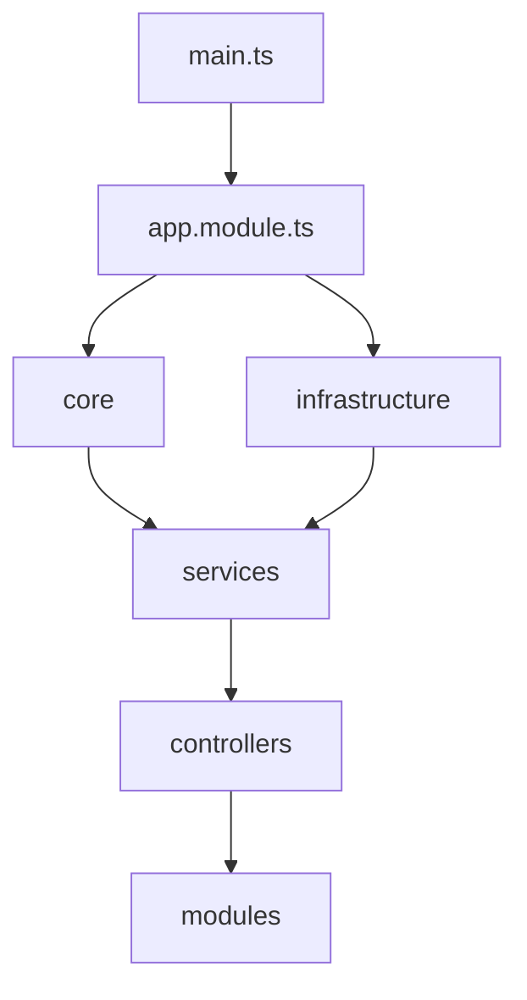
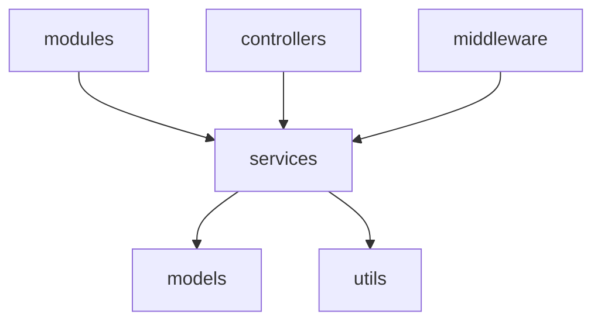
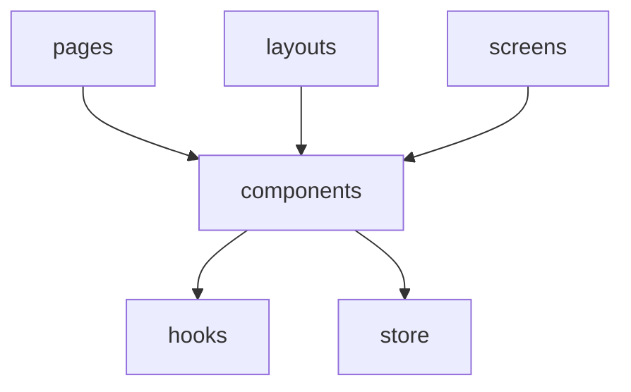

# 健康管理平台架构分析

## 一、现状分析

### 1. 目录结构问题

#### 1.1 重复目录
- `middleware` vs `middlewares`
- `mobile` 在根目录和src下重复
- `scripts` 在根目录和src下重复
- 前端相关目录分散在多处

#### 1.2 职责不清
- `core` 和 `infrastructure` 边界模糊
- `shared` 和 `common` 功能重叠
- `services` 和 `modules` 职责划分不明确

#### 1.3 架构断点
- 前后端代码混合
- 移动端代码分散
- 配置文件分散

### 2. 依赖关系分析

#### 2.1 核心依赖


#### 2.2 功能模块依赖


#### 2.3 前端依赖


## 二、问题与建议

### 1. 架构重构建议

#### 1.1 目录结构优化
```
health-platform/
├── packages/
│   ├── backend/        # 后端服务
│   ├── frontend/       # Web前端
│   ├── mobile/         # 移动端
│   ├── admin/          # 管理后台
│   └── shared/         # 共享模块
├── tools/              # 开发工具
├── scripts/            # 部署脚本
└── docs/              # 文档
```

#### 1.2 后端架构优化
```
backend/
├── src/
│   ├── core/           # 核心模块
│   ├── modules/        # 业务模块
│   ├── infrastructure/ # 基础设施
│   ├── interfaces/     # 接口定义
│   └── shared/         # 共享工具
```

#### 1.3 前端架构优化
```
frontend/
├── src/
│   ├── components/     # 通用组件
│   ├── pages/         # 页面
│   ├── hooks/         # 自定义钩子
│   ├── store/         # 状态管理
│   └── utils/         # 工具函数
```

### 2. 依赖优化建议

#### 2.1 模块化原则
- 明确模块边界
- 降低模块耦合
- 提高代码复用
- 便于单元测试

#### 2.2 依赖注入优化
- 使用依赖注入容器
- 接口优先于实现
- 遵循IoC原则
- 便于模块替换

#### 2.3 共享代码管理
- 抽取通用类型
- ���一错误处理
- 共享工具函数
- 统一配置管理

### 3. 具体实施建议

#### 3.1 第一阶段：结构调整
1. 合并重复目录
2. 规范命名约定
3. 整理配置文件
4. 分离前后端代码

#### 3.2 第二阶段：依赖梳理
1. 明确模块职责
2. 重构服务层
3. 优化依赖注入
4. 完善类型定义

#### 3.3 第三阶段：架构优化
1. 实现微服务架构
2. 优化数据流转
3. 增强安全机制
4. 提升性能指标

## 三、技术债务

### 1. 需要清理的代码
- 未使用的组件
- 重复的工具函数
- 过时的配置文件
- 测试数据文件

### 2. 需要重构的模块
- 认证授权模块
- 数据访问层
- 缓存机制
- 日志系统

### 3. 需要补充的功能
- 完整的单元测试
- API文档自动生成
- 性能监控机制
- 错误追踪系统

## 四、后续规划

### 1. 短期目标
1. 清理重复代码
2. 统一命名规范
3. 补充单元测试
4. 完善文档

### 2. 中期目标
1. 实现微服务拆分
2. 优化数据模型
3. 提升测试覆盖率
4. 增强安全机制

### 3. 长期目标
1. 架构升级
2. 性能优化
3. 扩展性提升
4. 维护性增强

## 五、最佳实践建议

### 1. 开发规范
- 使用ESLint和Prettier
- 遵循TypeScript最佳实践
- 采用Git Flow工作流
- 实施代��审查机制

### 2. 测试策略
- 单元测试覆盖核心逻辑
- 集成测试验证模块交互
- E2E测试保证功能完整
- 性能测试确保系统稳定

### 3. 部署流程
- 使用CI/CD自动化部署
- 实施蓝绿部署策略
- 采用容器化部署方案
- 建立监控告警机制

### 4. 文档管理
- 维护API文档
- 更新架构文档
- 编写开发指南
- 记录部署文档 