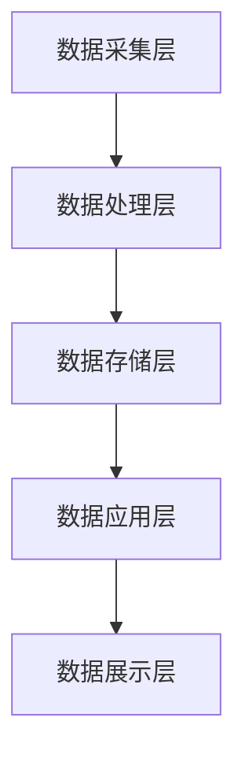

# 系统架构设计文档

## 1. 整体架构

### 1.1 微服务架构
```yaml
services:
  gateway-service:
    description: "API网关服务"
    responsibilities:
      - 请求路由
      - 负载均衡
      - 安全认证
      - 限流控制
    
  user-service:
    description: "用户服务"
    core_functions:
      - 用户管理
      - 认证授权
      - 个人信息维护
    
  health-data-service:
    description: "健康数据服务"
    core_functions:
      - 数据采集
      - 数据存储
      - 数据分析
      - 数据可视化
    
  ai-service:
    description: "AI服务集群"
    components:
      - 图像识别服务
      - 推荐系统服务
      - 健康评估服务
      - 预警分析服务
```

### 1.2 数据流架构
